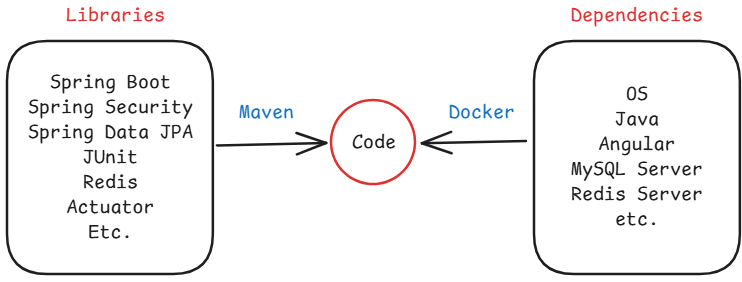
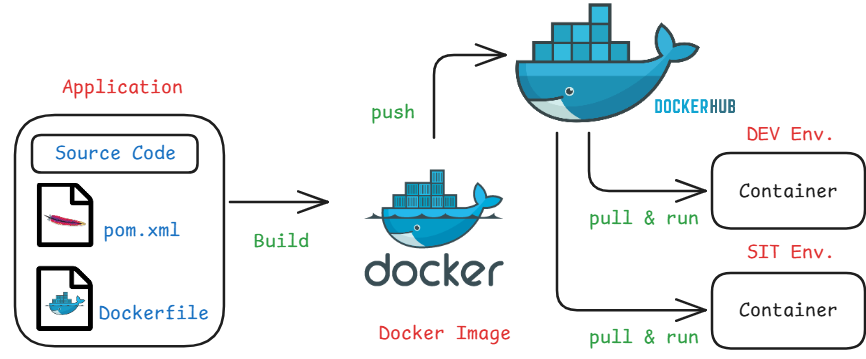
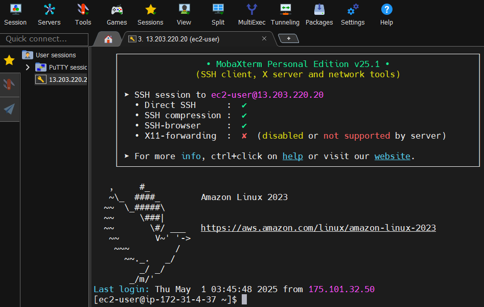
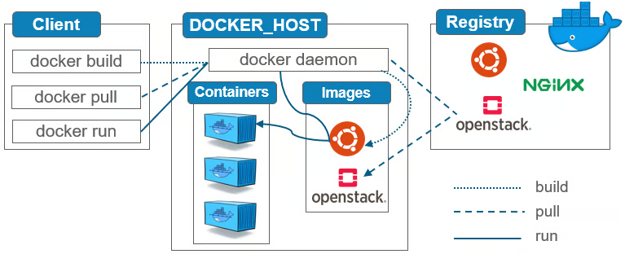
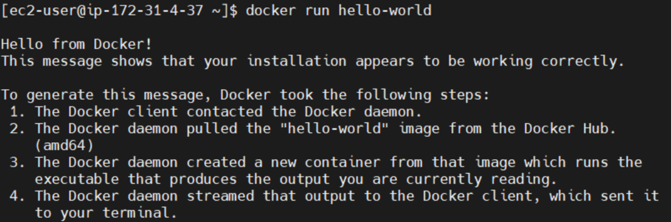
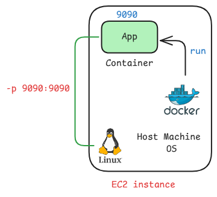

# Docker

[Articles](https://nirmalakumarsahu.in/articles.html) | [My Profile](https://nirmalakumarsahu.in)

[](https://www.docker.com/) [](https://www.docker.com/)

[](https://en.wikipedia.org/wiki/DevOps)

---

## Index
- [What is Docker?](#what-is-docker)
  - [Issues Without Docker](#issues-without-docker)
  - [Containerization](#containerization)
- [Docker Registry](#docker-registry)
- [Docker Setup on AWS EC2](#docker-setup-on-aws-ec2)
- [Docker Architecture](#docker-architecture)
  - [Common Docker Commands](#common-docker-commands)

---

## What is Docker?

- **Docker** is an open-source containerization software that enables developers to build, ship, and run applications using containers.

- **Containers** are lightweight, isolated environments that bundle an application with all its dependencies, ensuring it runs consistently across different environments.

- **Benefits of Docker**
  - **Portability**: Run applications anywhere, from local machines to cloud servers.
  - **Scalability**: Easily scale applications up or down with container orchestration.
  - **Consistency**: Eliminate issues caused by differences between development and production.
  - **Resource Efficiency**: Use system resources more efficiently compared to traditional virtual machines.

### Issues Without Docker

- **"It works on my machine" syndrome**: Applications behave differently in development, testing, and production due to inconsistent environments.

- **Complex setup and configuration**: Installing and configuring dependencies on every system can be time-consuming and error-prone.

- **Lack of environment isolation**: Multiple applications on the same machine can conflict over dependencies or versions.

- **Difficult scaling and deployment**: Manual deployment processes are slow, error-prone, and hard to scale reliably.

- **Harder collaboration**: Sharing and replicating environments across teams is difficult without a consistent runtime setup.

- **Increased system resource usage**: Traditional virtual machines are heavier and less efficient compared to containers.

> **Note**: To run our application, three key things are needed:
> - The code written by the developer.
> - Required libraries to execute the code (managed and downloaded using tools like Maven).
> - External software or system dependencies (e.g., databases, runtime environments) that are necessary for the application to run.

Installing and configuring all of these manually on different machines can be time-consuming and error-prone. **Docker helps by packaging the application, its libraries, and all required dependencies into a single container**, ensuring it runs consistently across any environment.



### Containerization 

- **Containerization** is the process of packaging software code and all its dependencies into containers.

- A **container** is a lightweight, portable virtual environment (not a full virtual machine).

- It ensures that the application runs reliably regardless of where it's deployed.

- **Popular containerization tools** include Docker, Podman, and LXC. 

- **Benefits of Containerization**
  - **Portability**: Run anywhere — local, staging, or production.
  - **Isolation**: Each container runs independently, reducing conflicts.
  - **Scalability**: Easily scale up or down using orchestrators like Kubernetes.
  - **Speed**: Faster boot times compared to VMs.
  - **Efficiency**: Lower resource usage by sharing the host OS kernel.

### [🔝 Back to Top](#index)

---

## Docker Registry

- A **Docker Registry** is a storage and distribution system for Docker images.

- It allows you to push, pull, and manage container images. 

- There are two types of registries
  - **Public** (accessible to anyone)
    - Ex: Docker Hub, GitHub Container Registry, Amazon ECR, Google Artifact Registry, Microsoft Azure Container Registry (ACR)
  - **Private** (restricted access)
    - Ex: Harbor, JFrog Artifactory, Sonatype Nexus Repository, Self-hosted Docker Registry

### Docker Hub

- **Docker Hub** is a public Docker Registry service provided by Docker Inc.

- It is the default registry used when you run `docker pull` or `docker push` without specifying a registry.

- It hosts official images, user-contributed images, and private repositories (with a free tier and paid options).



> **Note**: In real-time production environments, we use Kubernetes (e.g., EKS) to run containers. Docker is used here for image creation and testing.

### [🔝 Back to Top](#index)

---

## Docker Setup on AWS EC2 

**Step 1:** Launch an EC2 Instance on AWS Cloud

- **Log in** to your AWS account and go to **EC2 > Launch Instance**, then configure the following details 
for the instance:
  - **Name**: `docker-serv`
  - **Application and OS Image**: Amazon Linux
  - **Instance type**: `t2.micro` (Free Tier Eligible)
  - **Key pair**: Create new or choose existing
  - **Network settings**: Leave default
- Then click on **Launch instance**, Now you can see the instance. 
- After create the EC2 instance, choose the instance and click on **Connect**, then collect **Public IPv4 address** and **Username**.

- To create a key pair: Click on Create new key pair then give
  - **Key pair name**: `docker-key-pair`
  - **Key pair type**: RSA
  - **File format**: `.pem`
  - Click **Create key pair** then it will download the private key pem file.

**Step 2:** Connect to EC2 instance Using MobaXterm from your local machine 

- Install **[MobaXterm](https://download.mobatek.net/2512025030285413/MobaXterm_Installer_v25.1.zip)** if not already installed.
- Create a new SSH session, for that click on **Session** tab then choose **SSH**.
  - **Remote host**: Your EC2 Public IPv4 address
  - **Specify Username**:
    - `ec2-user` for Amazon Linux
    - `ubuntu` for Ubuntu
- Then Under **Advanced SSH settings** provide the `.pem` file under **User private key** then click **OK** to connect.

> **Note:** If you see the terminal of your EC2, then you're successfully connected.



**Step 3:** Install Docker

- For Amazon Linux:

```shell
sudo yum update -y
sudo yum install docker -y
sudo service docker start
sudo usermod -aG docker ec2-user
exit
```

- For Ubuntu:

```shell
sudo apt update
curl -fsSL get.docker.com | /bin/bash
sudo usermod -aG docker ubuntu 
exit
```

- After run the commands it will ask to restart click on R. Now we can verify the docker version and docker is running or not by using following commands

```shell
docker -v
docker info
```

> **Note:** Crate an account on [Docker Hub](https://hub.docker.com/)

### [🔝 Back to Top](#index)

---

## Docker Architecture

- The Docker client sent a request to the Docker daemon (the background service that handles containers).

- The Docker daemon downloaded the hello-world or the given image from Docker Hub (a public image registry).

- Using that image, the Docker daemon created and started a container, which executed a small program.

- The output from that program was sent back from the container to the Docker client and displayed in your terminal.
 
> **Note:**
> - Docker client: The command-line tool (docker) that you use to interact with Docker.
> - Docker daemon: A background process (dockerd) that manages Docker objects like images and containers.



#### Common Docker Commands

| Command                              | Description |
|--------------------------------------|-------------|
| `docker images`                      | List all local images |
| `docker pull <image-name>`           | Pull an image from Docker Hub |
| `docker run <image-name / image-id>` | Run a container from an image |
| `docker ps`                          | List running containers |
| `docker ps -a`                       | List all containers (including stopped) |
| `docker stop <container-id>`         | Stop a running container |
| `docker start <container-id>`        | Start a stopped container |
| `docker rm <container-id>`           | Remove a container |
| `docker rmi <image-id>`              | Remove an image |
| `docker system prune -a`             | Clean up unused containers/images |
| `docker logs <container-id>`         | View logs of a container |

**Example**

```shell
docker pull hello-world
docker run hello-world
```




> Instead of manually pulling the image, we can directly run it using docker run. Docker will first check if the image exists locally. If it’s not found, it will automatically download (pull) the image from Docker Hub and then run the container.

**Let’s run a Spring boot Rest API**
- Before proceeding, it’s important to understand that in an EC2 instance, we have a host machine, but our application runs inside a Docker container. Since containers are isolated from the host system, we can't access the application directly from outside. To enable external access, we need to configure port mapping, which links a port on the host machine to a port inside the container.



```shell
docker run -d -p 9090:9090 ashokit/spring-boot-rest-api
```
 
  - **-d:** restands for detached mode, which runs the container in the background and frees up the terminal so you can continue running other commands.
  - **-p:** is used for port mapping between the host and the container

> **Note:** The first 9090 is the host port (your EC2 or local machine), and the second 9090 is the container port. This means that requests to port 9090 on the host will be forwarded to port 9090 inside the container.

- After run the command you can check the docker image and docker containers got created.
- Now, to access the application from outside, we need to allow inbound traffic on the EC2 instance by updating its security group settings to open the mapped port.
- For that follow the below steps:
  - Go to your **EC2** instance in the **AWS Console**. 
  - Click the **Security** tab. 
  - Under **Security details**, click on the linked **Security Group** name. 
  - Navigate to the **Inbound rules** tab and click **Edit inbound rules**. 
  - Click **Add rule** and configure the following:
    - **Type:** `Custom TCP` 
    - **Port range:** `9090 [host port]` 
    - **Source:** `Anywhere-IPv4` (or restrict to your IP for better security)
    - Click **Save rules** to apply the changes.
- Now to access the application 
  - URL: http://`Public IP`:`port`/welcome/sahu

### [🔝 Back to Top](#index)

---
