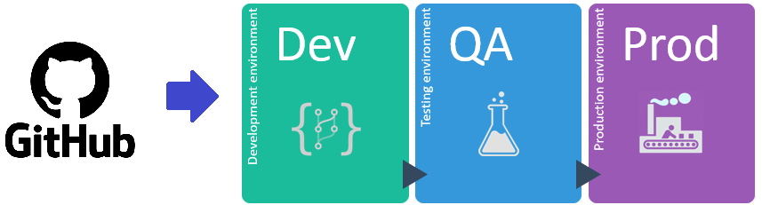

# Jenkins CI/CD with Docker 

[Articles](https://nirmalakumarsahu.in/articles.html) | [My Profile](https://nirmalakumarsahu.in)

    

 

---

## Index
- [Real-Time Application Environments](#real-time-application-environments)
- [Types of Environments in Real-Time](#types-of-environments-in-real-time)
  - [Teams in a Real-Time Application Environment](#teams-in-a-real-time-application-environment)
  - [What is DevOps?](#what-is-devops)
- [Build & Deployment Process](#build--deployment-process)
- [Challenges in Manual Process](#challenges-in-manual-process)
  
---
## Real-Time Application Environments

An environment is a setup or platform used to run our application. Each environment has:
- Its own servers (physical or cloud-based).
- Its own databases, configurations, and sometimes different versions of code.

### Types of Environments in Real-Time

- **Local Environment**  
  Developers' own machines (laptops/desktops). Code is run locally for quick development, debugging, and unit testing. Usually connected to mock services or local databases.

- **Development (Dev) Environment**  
  A shared environment where developers deploy code for integration. Used to test early versions of the app together (integration testing, component testing).  
  
- **Testing/ QA Environment**  
  Used by Quality Assurance (QA) teams to perform functional testing, regression testing, and bug verification. This environment mimics real-world usage closer than Dev. Stable builds are pushed here.  
  
- **UAT (User Acceptance Testing)**  
  Sometimes business users or clients test the application to approve it for production. Ensures the product meets business needs.  
  
- **Staging/ Pilot/ Pre-Production**  
  A mirror of the Production environment. Final stage before going live. Used for final testing, load testing, performance testing, user acceptance testing (UAT), performance testing, and approval. Often includes production-like data.  

- **Production (Prod)**  
  The live environment used by end-users. Must be highly available, secure, and monitored. Only fully tested and approved code is deployed here.  

- **Disaster Recovery (DR)** (Optional)  
  A backup environment for production. If production fails (due to major incidents like server crashes, cyberattacks), DR takes over. May have a slight data lag depending on setup.  

- **Performance/ Load Testing Environment** (Optional)  
  Separate environment to simulate heavy loads and test system performance, scalability, and stability under stress. Helps in tuning the app and infrastructure.  

- **Sandbox Environment** (Optional)  
  A safe, isolated environment where experiments, PoCs (Proof of Concepts), or learning/testing new tools can happen without impacting official development or production work.

### Teams in a Real-Time Application Environment

- **Development Team**  
  Responsible for designing and writing the application code, implementing features, and fixing bugs.

- **Testing Team**  
  Focused on verifying and validating the application's functionality, ensuring it meets quality standards through various types of testing (unit, integration, system, acceptance).

- **Operations Team**  
  Manages the build, deployment, and release processes. They are responsible for maintaining infrastructure and ensuring application availability in different environments.

- **DevOps Team**  
  A combined team that integrates both development and operations practices. DevOps streamlines collaboration between developers and operations staff to improve build, testing, deployment, and monitoring processes.

### What is DevOps?

- **DevOps** is a methodology that bridges the gap between development and operations teams. It focuses on automating and streamlining the build, testing, deployment, and infrastructure management processes to deliver applications more efficiently and reliably.
- By adopting a **DevOps** process, teams can simplify and accelerate application build and deployment workflows, leading to faster release cycles and improved product quality.

---

## Build & Deployment Process

The Build and Deployment process ensures that all services are properly compiled, packaged, containerized, and deployed consistently across environments (development, staging, production). The steps include:

1. Take the latest source code from GitHub
2. Compile project source code
3. Execute unit test cases
4. Perform code review using **SonarQube**
5. Package the application (JAR/WAR)
6. Build Docker image
7. Create Docker container
8. Deploy the application on the server

---

## Challenges in Manual Process

- **Daily Deployment Requirement**: The latest code must be manually deployed every day, increasing workload.
- **Multiple Environment Management**: Code must be deployed across various environments (e.g., development, testing, staging, production), adding complexity.
- **Time-Consuming**: Manual deployment processes take a significant amount of time to complete.
- **Repetitive Work**: The same deployment steps must be performed repeatedly, leading to inefficiency.
- **High Risk of Errors**: Manual handling increases the chances of mistakes, such as missed steps, wrong configurations, or partial deployments.  
